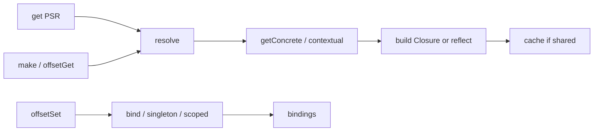

# Identity

| Field | Value |
|-------|-------|
| Composer | `fabricate/chassis`[^composer] |
| Path | `src/Fabricate/Chassis/` |
| PHP namespace | `Fabricate\Chassis\` |
| Implements | `WireframeServiceContainer` → public `ServiceContainer`[^wireframe][^service-container] |
| Umbrella | `replace` → `self.version`[^root] |
| Layer role | Other component — Core-free; Core may depend on Chassis[^dep] |

# How it works

## Mental model

Laravel-shaped **service container**: register abstract → concrete, then resolve with reflection-driven constructor injection, optional sharing, contextual attributes, and resolving lifecycle hooks.[^chassis]



## Entry doors

| Entry | Behavior |
|-------|----------|
| `get($id)` | PSR-11 API. Calls `resolve()` (same engine as `make` — unbound concrete classes can autowire). On failure: rethrow if already `bound` (or circular); else wrap as `EntryNotFoundException`.[^chassis] |
| `has($id)` | `bound()` — binding, instance, or alias. |
| `make($abstract, $parameters = [])` | Resolve / autowire; returns `BindingResolutionException` (etc.) without the PSR `EntryNotFoundException` wrap. |
| `offsetGet` / `$c['x']` / `__get` | → `make()` |
| `offsetSet` / `$c['x'] = $v` / `__set` | → `bind()` as Closure (value or Closure) |
| `offsetExists` | → `bound()` |
| `offsetUnset` | Drops binding + instance + resolved flag for that key |

**`get` vs `make`:** both resolve/autowire. Difference is the failure contract — `get` maps unbound failures to PSR `EntryNotFoundException`; `make` / ArrayAccess expose Chassis resolution exceptions directly.

## Registry

- **Bindings** — `bind()` / `bindIf()`, `tag()` / `tagged()`, `bindMethod()`, `when()` / `addContextualBinding()`, `#[Bind]`[^bindings]
- **Singletons** — `singleton()` / `singletonIf()`, `scoped()` / `scopedIf()`, `forgetScopedInstances()`, shared `instances`[^singletons]
- **Aliases / extenders** — `alias()`, `extend()`, `$aliases` / `$abstractAliases` on `Chassis`[^chassis]
- **Instances / lifecycle** — `instance()`, `factory()`, `flush()`, `getInstance()` / `setInstance()`[^chassis]
- **Resolving hooks** — `beforeResolving()` / `resolving()` / `afterResolving()` (registration + fire path)[^callbacks]

Surface restored from 0.6 donor logic; OKF is `draft` until Angel re-verifies.

## Resolve city

`resolve()` / `build()`:[^chassis][^bindings]

1. Alias → abstract
2. Before-resolving callbacks[^callbacks]
3. Contextual concrete + parameter overrides (`$with`)
4. Return cached shared instance when safe
5. `getConcrete` → `build()` (Closure factory or `ReflectionClass` + deps) or recurse `make()`
6. Extenders (when registered)
7. Cache if shared (`singleton` / `scoped` / `#[Singleton]` / `#[Scoped]`)
8. Resolving callbacks; mark resolved

Constructor deps walk primitives, variadics, class types, and contextual attributes (`resolveFromAttribute`).

## Method injection

`call($callback, $parameters = [], $defaultMethod = null)` → `BoundMethod` with container-aware argument resolution.[^bound-method]

## Attributes

| Attribute | Role |
|-----------|------|
| `#[Bind]` | Class-level concrete binding hint |
| `#[Singleton]` / `#[Scoped]` | Shared / scoped lifetime |
| `#[Cache]` | Contextual cache-store resolve — typed against `WireframeServiceContainer`; needs `fabricate/cache` at runtime |

Composer `suggest` also lists config / filesystem / log for future contextual attributes.[^composer]

## Failures

- `EntryNotFoundException` — PSR `get` when unbound and unresolvable
- `BindingResolutionException` — build / injection failures
- `CircularDependencyException` — cycle on the build stack

# Requires

```json
"fabricate/reflection": "^0.7.0",
"psr/container": "^1.1.1 || ^2.0.1"
```

Provides `psr/container-implementation` `1.1 || 2.0`.[^composer]

Public consumer contract: [contracts](contracts.md) `ServiceContainer` (`get`/`has`/`make`/`call`/`instance`/`resolved`/`afterResolving` + ArrayAccess). Chassis-local `WireframeServiceContainer` adds the binding kitchen sink (`bind`, `singleton`, `when`, tags, …).

# Surface

| Symbol | Role |
|--------|------|
| `Chassis` | Concrete container |
| `Contracts\WireframeServiceContainer` | Chassis-local wireframe API (extends public `ServiceContainer`) |
| `Concerns\Bindings` | bind / build / tags / contextual / method bindings |
| `Concerns\Singletons` | singleton / scoped / `*If` / forget scoped |
| `Concerns\CallbackManagement` | resolving callback storage + fire helpers |
| `ContextualBindingBuilder` | `when()->needs()->give*` fluent API |
| `RewindableGenerator` | Countable iterator for `tagged()` |
| `BoundMethod` | `call()` + `callMethodBinding` path |
| `Util` | Reflection helpers for parameters / contextual attrs |
| `Attributes\*` | Bind, Singleton, Scoped, Cache |
| Exceptions | EntryNotFound, BindingResolution, CircularDependency |

# Related

- [contracts](contracts.md) — public `ServiceContainer` + Chassis swap surfaces
- [reflection](reflection.md) — ReflectsClosures / Reflector used by bind/build paths
- [Component dependency direction](../conventions/dependency-direction.md)
- [MagicAlias and provider ownership](../conventions/magic-aliases.md) — Core owns providers; domains stay Chassis-free

[^composer]: fabricate/chassis manifest
[^chassis]: Chassis class
[^wireframe]: WireframeServiceContainer
[^service-container]: ServiceContainer (public contract)
[^bindings]: Bindings concern
[^singletons]: Singletons concern
[^callbacks]: CallbackManagement concern
[^bound-method]: BoundMethod
[^dep]: Dependency direction rule
[^root]: Umbrella replace
