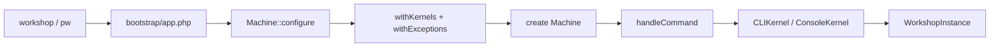

# Identity

| Field | Value |
|-------|-------|
| Path | `src/Fabricate/Core/` (+ sibling `src/Fabricate/Console/` for Workshop) |
| PHP namespace | `Fabricate\Core\` / `Fabricate\Console\` |
| Implements | `Program` (Machine extends Chassis)[^program][^machine] |
| Layer role | Composition root — may know everything[^machine] |

# How it works

## Mental model

**Machine** is the application (`Program` + Chassis). **AssemblyLine** configures bindings before `create()`. **ConsoleKernel** (`CLIKernel`) builds **WorkshopInstance** (Symfony Console app) for the `workshop` binary.

Verified working today: listing Symfony defaults (`list` / `help` / `completion`) with banner **ScrapyardIO Framework 0.7.0**.[^workshop][^machine]

## Boot path (CLI)

1. App `workshop` requires autoload + `bootstrap/app.php` → `Machine::configure(…)->create()`.
2. `Machine::configure($basePath)->withKernels()->withEvents()->withExceptions()` then `create()`.[^machine][^assembly]
3. `withKernels()`: `singleton(CLIKernel::class, ConsoleKernel::class)`.[^assembly][^cli-kernel][^kernel]
4. `withEvents()`: registers Core `EventServiceProvider` on `booting`; early `events` singleton + aliases on Machine.
5. `withExceptions()`: `singleton(ExceptionHandler::class, Handler::class)`.[^handler]
6. `handleCommand($input)` → `make(CLIKernel::class)` → `handle` / `terminate`.[^machine]
7. `ConsoleKernel::getWorkshop()` builds `WorkshopInstance($program, $events, $program->version())` and dispatches `WorkshopStarting`; Symfony COMMAND/TERMINATE reroute to Fabricate command events.[^workshop][^machine]

`ConsoleKernel::$bootstrappers` includes LoadEnvironment / LoadConfiguration / HandleExceptions / RegisterMagicAliases / RegisterProviders / BootProviders.[^kernel]

## AssemblyLine switches

| Method | Status |
|--------|--------|
| `withKernels()` | **On** — binds CLIKernel |
| `withExceptions()` | **On** — binds ExceptionHandler |
| `withEvents()` | **On** — Core EventServiceProvider + discovery toggles |
| `withProviders()` | **On** — merges `bootstrap/providers.php` via `RegisterProviders` + `getBootstrapProvidersPath()` |
| `withCommands()` | **On** — registers app Console/Commands paths after kernel resolve |

## Provider load path

`RegisterProviders` → `Machine::registerConfiguredProviders()` → `ProviderRepository::load()` writes `bootstrap/cache/services.php`, registers eager providers, `addDeferredServices()`. App providers listed in `bootstrap/providers.php` load automatically (no extra wiring).

`WorkshopServiceProvider` registers `package:discover` (`PackageDiscoverCommand` → `PackageManifest::build()`).

## Gaps (honest)

- Deferred providers: Machine still may not auto-`loadDeferredProvider` from `make()`/`resolve()` (Chassis path) — watch when deferred SPs return.
- Queue hooks deferred (`CallQueuedListener`, `JobAttempted` defer listener) — see [events](events.md).
- More Workshop Core commands (About, …) still empty in the map.

# Surface

| Symbol | Role |
|--------|------|
| `Machine` | Program + Chassis; `VERSION` / `version()` = `0.7.0` |
| `Setup\AssemblyLine` | Fluent configure (`withKernels`, `withEvents`, `withProviders`, `withCommands`, `withExceptions`, `create`) |
| `ProviderRepository` | Compiles/loads `services.php` manifest; eager + deferred provider registration |
| `Console\ConsoleKernel` | Concrete `CLIKernel` |
| `Console\PackageDiscoverCommand` | `package:discover` → PackageManifest::build |
| `Fabricate\Console\WorkshopInstance` | Symfony Application + `CLIMachine` |
| `Exceptions\Handler` | Bound ExceptionHandler |
| `Providers\FilesystemServiceProvider` | Binds `files` / `filesystem` (domain stays pure) |
| `Providers\LogServiceProvider` | `singletonIf('log')` + aliases (Machine also early-binds for HandleExceptions) |
| `Providers\ConsoleSupportServiceProvider` | Aggregates Workshop CLI providers |
| `Providers\WorkshopServiceProvider` | Signals + `PackageDiscover` command map |
| `ComposerScripts` | post-autoload-dump / clearCompiled |
| `Providers\CoreServiceProvider` | Schedule, CliDumper, Dispatcher caster, CommandFinished defer (not JobAttempted) |
| `Console\CliDumper` | CLI VarDumper handler with source via `Concerns\ResolvesDumpSource` (no HTML dumper) |
| `MagicAliases\Storage` | Alias → `filesystem` |
| `MagicAliases\Workshop` | Alias → `CLIKernel` |
| `MagicAliases\Event` | Alias → `events` (slim; no EventFake) |
| `Providers\EventServiceProvider` | Listen/subscribe/discover; registered via `withEvents()` |
| `Events\DiscoverEvents` / `Terminating` | Listener discovery + terminate marker |
| `Bootstrap\BootProviders` | In ConsoleKernel bootstrapper list |
| `DefaultProviders` | Includes Core Filesystem provider; others mostly commented |

# Related

- [contracts](contracts.md) — `CLIKernel`, `CLIMachine`, `Program`, `ExceptionHandler`
- [chassis](chassis.md) — Machine extends Chassis
- [filesystem](filesystem.md) — domain package; Core owns provider + Storage
- [console](console.md) — domain package; Core owns ConsoleSupport/Workshop providers + Workshop alias
- [events](events.md) — domain Dispatcher; Core owns Event alias + ESP
- [MagicAlias and provider ownership](../conventions/magic-aliases.md)
- [Component dependency direction](../conventions/dependency-direction.md)

[^machine]: Machine (Program)
[^assembly]: AssemblyLine
[^kernel]: ConsoleKernel
[^workshop]: WorkshopInstance (Symfony Application)
[^handler]: Exception Handler
[^cli-kernel]: CLIKernel contract
[^program]: Program contract
